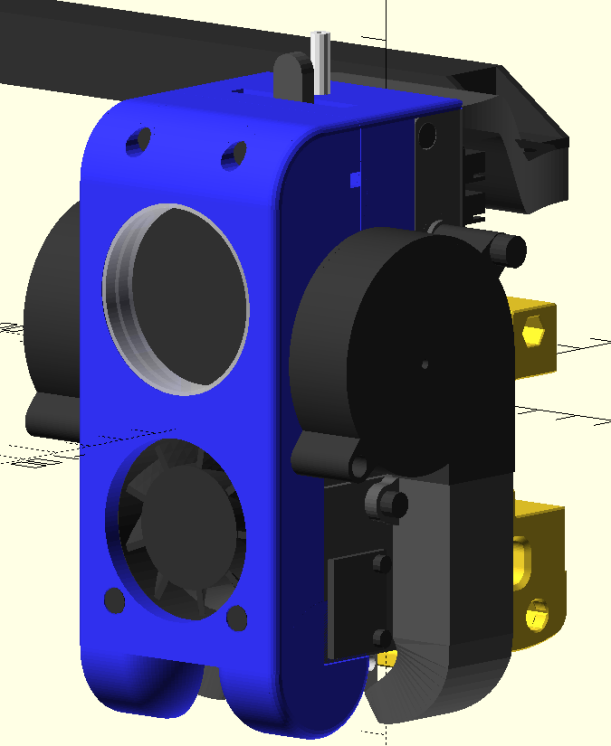
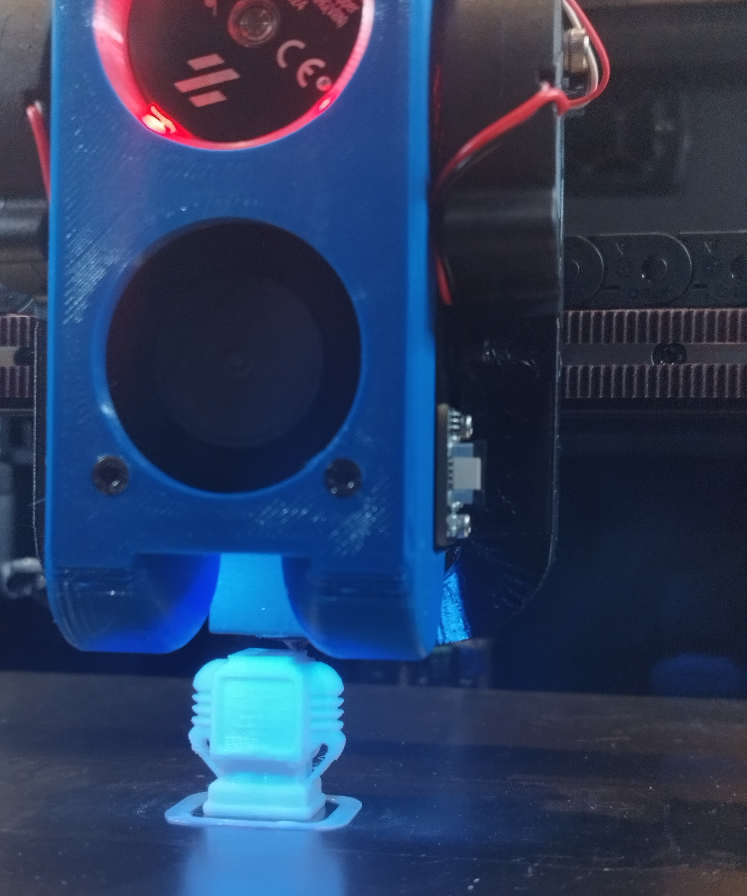
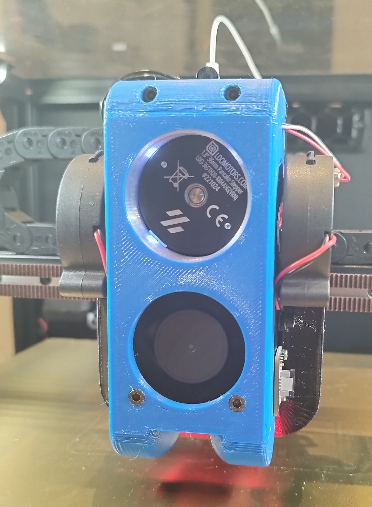

**This is a work-in-progress project**

**The toolhead is finished and working, but the assembly instructions are coming**

# Description

YetAnotherBurner is (as the name suggests) yet another attempt to design a toolhead for Voron Trident (and 2.4) 3D printers. The main concern the author had about the existing solutions are:
- Usage of custom extruders
- Lack of attention to the part cooling (making it impossible to print PLA overhangs with the printer doors closed)
- Lack of LEDs or Trident support in some of the alternative projects

The features of this solution are:
- Strong part cooling (using 2x 5015 blower fans)
- Support of LEDs (2x part highlight + 4x status LEDs at the top)
- Usage of an existing extruder (BondTech LGX Lite)
- Easy loading of the filament + good grip of the bowden tube (by the extruder itself)
- Support of the toolhead breakout PCB (same PCBs as used in Stealthburner)
- Support of ADXL345 accelerometer mounting
- Doesn't interfere with KlickyProbe, so it can be used as normal with this toolhead

The toolhead uses BondTech LGX Lite extruder and currently only supports Dragon High Flow hotend. It is also based on Stealhburner's X Frame mounts (so migration from Stealthburner should be more or less straightforward).

### Known drawbacks
- Due to the size of the toolhead along X-axis there's a limit on the toolhead's travel in the front corners (Y=0) of the printer. Y-axis, for example, needs to be homed first in case the toolhead is positioned around Y=0
- As of the time of writing no support of alternative hotends or accelerometers

## BOM
See the [BOM document](docs/BOM.md)

## Assembly
See the [Assembly document](docs/Assembly.md)

## Development
The OpenSCAD models included as source files rely on [NopSCADlib](https://github.com/nophead/NopSCADlib). In order to be able to open them and render the model in OpenSCAD one needs to install it first.

On Linux it's done by following a couple of simple steps:

1. `mkdir -p cd ~/.local/share/OpenSCAD/libraries`
2. `cd ~/.local/share/OpenSCAD/libraries`
3. `git clone https://github.com/nophead/NopSCADlib.git`

Once, it's done everything should be ready. The following are the main files:

- `FullModel.scad` - the complete model with all the screws, heat inserts and other parts. Due to specifics of NopSCADlib, it renders slowly (up to 30 seconds), so, please, be patient :)
- `common.scad` - common constants and functions that are used among multiple files 
- `ToPrint` - contains all the parts that need to be printed in order to assemble this toolhead, and which are part of this toolhead
- `ToPrint/DragonHF` - contains the parts specific to the Dragon HighFlow hot end. In future, there might be other cartidges added in case of demand.
- `lib` - some extra common "library" functions to help rendering/calculating things like screws, heat inserts, etc.
