# Printing suggestions
- Layer: 0.2mm
- Filament: PETG
- Part Cooling: for majority of parts (see the **Advice** comments inside each section)
- Supports: for some of the parts (see the **Advice** comemtns inside each section)

# Assemlby

## 1. Hot End cartridge
### 1.1. Dragon High Flow

#### 1.1.1. Print the files
Start by printing the hot end cartridge parts from the respective [subdirectory](../ToPrint/DragonHF/stls)

#### 1.1.2. Add heat inserts to the front part

#### 1.1.3. Add heat inserts to the back part

#### 1.1.4. Cut PTFE tube
It needs need to be as precise as possible to 29.7mm length. An advice to use calipers to mark the length and a sharp knife to do a right-angle cut.
This is one of the important points to ensure smooth and easy loading of filament

#### 1.1.5. Mount the hotend to the back part

- **Make sure that the heater block is facing the front (see the picture)**
- Use 2x M2.5x16 screws to mount the HE to the back part of the cartridge
  There's no much preference to the direction of the wires (of the heater cartridge and the thermistor), however, the advice is to leave them, on the right.
  Also, please, keep in mind that the wires will be routed first straight in the direction of positive Y and then will go straigh up, behing the assembled hotend cartridge.
- Insert the PTFE tube and make sure it fits into the HE's slot

#### 1.1.6. Mount the front of the HE cartridge
- Use 2x M3x20 screws to mount the front part of the HE cartridge (don't tighten yet)
- Push PTFE tube a little bit, to double check that it's still in place, pushed into the HE's slot
- Tighten the screws
- Use 2x M2.5x16 screws to attach the HE to the front part of the cartridge

#### 1.1.7. Attach the cooling fan
(the screenshots use 40x11 fan because the NopSCADlib didn't have 40x10, but in reality the 40x10 one must be used)

- Use 2x M3x12 screws to attach the cooling fan to the HE cartridge (top only!)
  - Make sure the wires face up
  - Make sure the screw caps fit into fan's slots for them, so that they don't stick above the surface
- Guide the wires throw the channel as pictured below
  - Make sure they are below the surface, cause later other parts will be mounted on top
- You may want to shorten the wires of the fan (by cutting and crimping them) so that the cablework is neater

## 2. Attach the Hot End cartridge to the X-carriage

### 2.1. Top screws
It's time to attach it to the printer. Use 2x M3x6 screws to initially fix the assembled cartridge on the X-carriage

Make sure the heater cartridge's and thermistor's wires are guided through the shaft available in the X-carriage. It may require a bit of bending of the wires.

### 2.2. Bottom screws
Now use 2x M3x50 screws to completely fix the cartridge

## 3. Assemble the PCB bracket

### 3.1 Print the bracket
[PCB Bracket STL](../ToPrint/stls/PCB_Bracket.stl) - **Advice:** use support touching build plate

### 3.2. Add heat inserts

### 3.3. Attach the PCB
Use 2x M3x6 screws to attach the PCB (sorry for OpenSCAD's rendering artifacts)

## 4. Attach the PCB bracket to X-carriage

Use 2x M3x20 screws to attach the assembled bracket to the X-carriage. Pay attention to the fan wires - they shouldn't be squeezed between the parts

After that it's ok to attach the wires of the fan, heater cartridge and thermistor to the PCB

## 5. Extruder

### 5.1. Print the parts
[Bracket STL](../ToPrint/stls/ExtruderMount.stl) - **Advice:** use support touching build plate

[Lever Extension STL](../ToPrint/stls/ExtruderLeverExtension.stl) - **Advice:** switch off part cooling. It requires very good layer adhesion. Non-ideal bridges shouldn't be a problem, bad layer adhesion will be.

### 5.2. Extruder's connector
Most probably your BondTech LGX Lite's motor comes with a different connector or no connector at all.
In this step, shorten the wires of the motor (be careful, scroll the manual further to get an idea of routing of the motor's wires and thus what the length should be) and use a crimping tool to fit a 4-pin JST-XH connector.

### 5.3. Attach the extruder to the bracket
- Use 4x M3x12 screws to attach the extruder to its bracket
- Guide the wires throught the channel in the bracket as shown on the picture
  - Make sure that the wires are below the surface, as the part will attached tightly to another one later

### 5.4. Attach the tensioning lever extension
This one will be later used to move the lever when the toolhead is fully assmebled.
It may seem to not fit too tight, but it won't be problem: due to the small knob it won't go anywhere after the extruder is covered with the top cover.

### 5.5. Attach the bowden tube
Choose between 2 options

#### If using one single bowden tube between the spool and the toolhead
*This is the original Stealthburner's/Voron's design, where one single bowden tube goes from the filament spool outside the printer, all the way into the toolhead*

If going for this option:

- Perform partial top cover assembly by following [step 1](#8-1-print-the-part) and [step 2](#8-2-add-heat-inserts) there
- Guide the bowden tube through the filament hole in that part
- Leave the top cover hanging on the bowden tube for now
- Properly fix the bowden tube in the extruder (it normally comes with all needed parts)

#### If using a short bowden tube
*This is the case when the toolhead has a short "tension relief" bowden tube, but the filament hangs in the air inside the printer*

Cut the bowden tube to your liking (~50-60mm recommended) and properly fix it in the extruder (it normally comes with all needed parts)

### 5.6. Attach the exturder to the toolhead
- Use 2x M3x16 screws (optionally with washers) to attach the assembled extruder, through the PCB bracket loops, to the toolhead.
- Guide the motor's wires through the arc in the PCB bracket and connect to the PCB
- Double check that neither fan's nor motor's wires are squeezed between the parts

## 6. Part cooling fan splitter
Most probably your Breakout PCB (at least LDO's one) comes with a single connector for the part cooling fan. As this setup uses 2 fans, a splitter is needed.

- Solder ~6cm of wires to two female JST-XH plugs, following the same color scheme as the PCB's connector
- (optionally, but recommended) Cover the soldered contacts with the heat shrink tubes
- Use a crimping tool to connect together 2 wires of the same color and attach the JST-XH terminal to them
- Insert the crimped wires into the male JST-XH plug, following the +/GND polarity
- Connect the splitter to the Breakout PCB

## 7. Drag Chain Holder

### 7.1. Print the part
[Drag Chain Holder STL](../ToPrint/stls/DragChainHolder.stl) - **Advice:** use support touching build plate

### 7.2. Add heat inserts
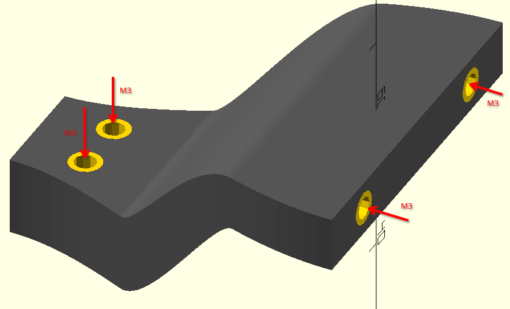

### 7.3 Attach the drag chain
- Use 2x M3x8 to attach the drag chain holder to the toolhead
- Use the stock M3 screws to attach the drag chain to the holder
- Connect the main MicroFit connector from the drag chain to the PCB

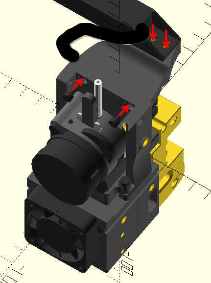

## 8. Top Cover

### 8.1. Print the part
[Top Cover STL](../ToPrint/stls/[a]_TopCover.stl)

### 8.2. Add heat inserts 
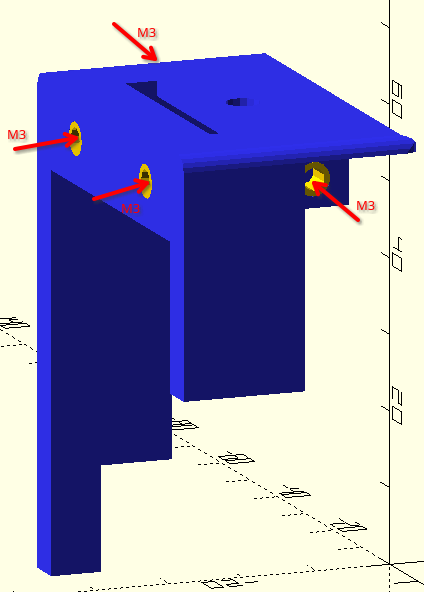

### 8.3. Attach to the toolhead
- Fit the top cover from the top, guiding the bowden tube and the extruder's lever throught the respective holes
- Use 2x M3x8 screws to fix the top cover in place

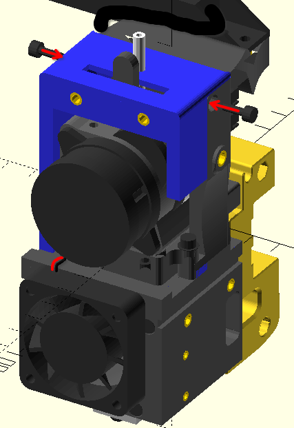

## 9. Front Cover and LEDs

### 9.1. Print the parts
[Front Cover STL](../ToPrint/stls/[a]_FrontCover.stl) - **Advice:** use support touching build plate. The rounding is not ideal. Please, feel free to raise an issue with suggestions.

[Motor Window Insert STL](../ToPrint/stls/[c]_MotorWindowInsert.stl) - as indicated in the file name, this part need to be print using a transparent filament, so that the light from the LEDs is visible

### 9.2. Insert the ring into the panel
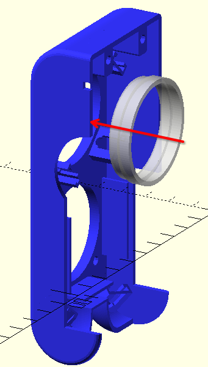

### 9.3. Solder LEDs
6 LEDs and need to be solder into a single strip in order to be then inserted into the front cover.
Observe the markings on the LEDs and follow the directions shown on the photo.

Pay attention to the wire colors. One the photo: red - 5v, black - Gnd, white - Data.

- Solder the wires, making sure there's enough length (see the hints on the photo)
- Use a crimping tool to add a 3-pin MicroFit connector (pay attention to the wire positions, double check with Voron's female connector)

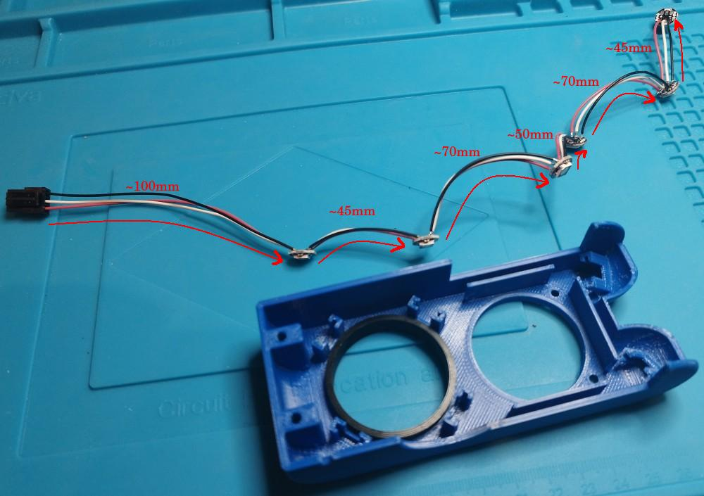

### 9.4. Insert LEDs into the panel
Fit the LEDs into their respective slots as shown on the photo

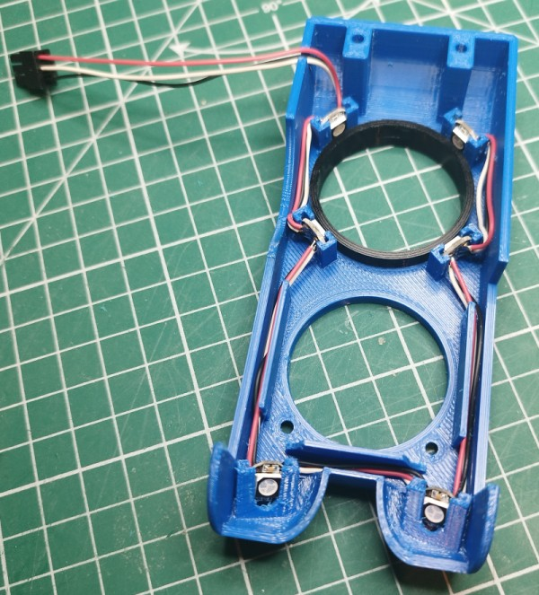

### 9.5. Fit the front cover onto the toolhead
- Slide the assembled part from the front onto the toolhead
    - A slight push may be needed so that the ring fits the motor and fan fits the guides on the panel
    - There's a small collision with teh motor wires, but they should have enought space to bend slightly
    - Make sure that the LED wires with connector a guided through the respective hole in the panel
- Use 4x M3x20 screws to fix the cover in place
- Connect the LED strip to the respective connector of the printer

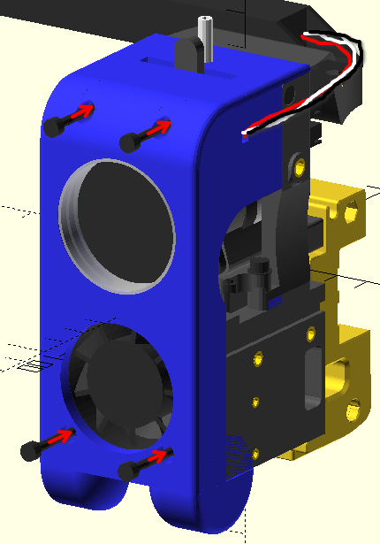

## 10. Part cooling ducts

### 10.1. Print the parts
[2x Cooling Duct STL](../ToPrint/stls/CoolingDuct_x2.stl) - **Advice:** print both together; use support touching build plate

### 10.2. Attach to the toolhead
- Use 4x M3x6 screws (2 on each side) to attach the cooling ducts

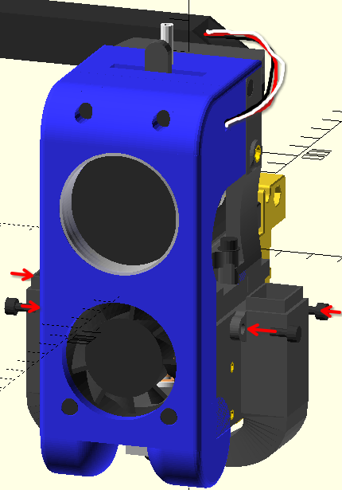

## 11. Blower fans
- Slide the blower fans on both sides from the top (they should fit tightly on the ducts)
  - The left blower will have the fan facing outside
  - The right blower will have the fan facing inside. The toolhead part intentionally have cuts and spacing to ensure proper air intake.
- Try to guide the wires through the channels on the Hotend cartridge to make them less visible
- Use 2x M4x20 screws (1 on each side) to attach the blower fans to the toolhead (the top hole only)
- Connect the blower fans to the splitter made in [the previous step](#6-part-cooling-fan-splitter)

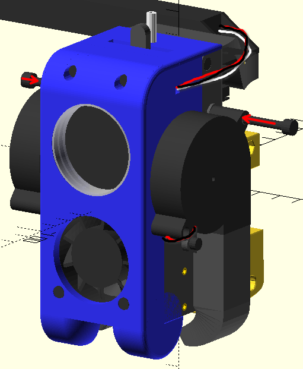

## 12. Accelerometer
Use 2x M2x6 screws to attach the ADXL345 accelerometer

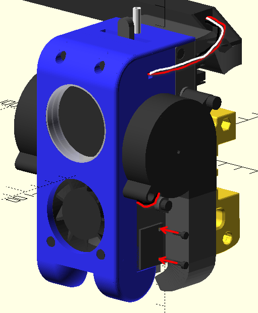
