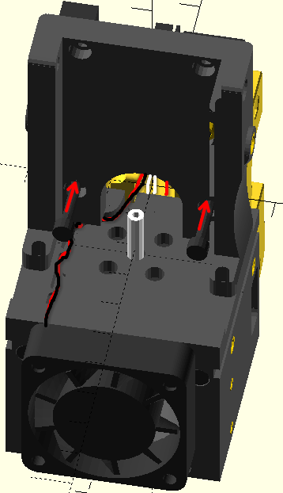

## IN PROGRESS (coming soon)

## Hot End cartridge
### Dragon High Flow

#### Print the files
Start by printing the hot end cartridge parts from the respective [subdirectory](../ToPrint/DragonHF/stls)

#### Add heat inserts to the front part

#### Add heat inserts to the back part

#### Cut PTFE tube
It needs need to be as precise as possible to 29.7mm length. An advice to use calipers to mark the length and a sharp knife to do a right-angle cut.
This is one of the important points to ensure smooth and easy loading of filament

#### Mount the hotend to the back part

- **Make sure that the heater block is facing the front (see the picture)**
- Use 2x M2.5x16 screws to mount the HE to the back part of the cartridge
  There's no much preference to the direction of the wires (of the heater cartridge and the thermistor), however, the advice is to leave them, on the right.
  Also, please, keep in mind that the wires will be routed first straight in the direction of positive Y and then will go straigh up, behing the assembled hotend cartridge.
- Insert the PTFE tube and make sure it fits into the HE's slot

#### Mount the front of the HE cartridge
- Use 2x M3x20 screws to mount the front part of the HE cartridge (don't tighten yet)
- Push PTFE tube a little bit, to double check that it's still in place, pushed into the HE's slot
- Tighten the screws
- Use 2x M2.5x16 screws to attach the HE to the front part of the cartridge

#### Attach the cooling fan
(the screenshots use 40x11 fan because the NopSCADlib didn't have 40x10, but in reality the 40x10 one must be used)

- Use 2x M3x12 screws to attach the cooling fan to the HE cartridge (top only!)
  - Make sure the wires face up
  - Make sure the screw caps fit into fan's slots for them, so that they don't stick above the surface
- Guide the wires throw the channel as pictured below
  - Make sure they are below the surface, cause later other parts will be mounted on top
- You may want to shorten the wires of the fan (by cutting and crimping them) so that the cablework is neater

## Attach the Hot End cartridge to the X-carriage

### Top screws
It's time to attach it to the printer. Use 2x M3x6 screws to initially fix the assembled cartridge on the X-carriage

Make sure the heater cartridge's and thermistor's wires are guided through the shaft available in the X-carriage. It may require a bit of bending of the wires.

### Bottom screws
Now use 2x M3x50 screws to completely fix the cartridge

## Assemble the PCB bracket

### Print the file
[PCB Bracket STL](../ToPrint/stls/PCB_Bracket.stl)

### Add heat inserts

### Attach the PCB
Use 2x M3x6 screws to attach the PCB (sorry for OpenSCAD's rendering artifacts)

## Attach the PCB bracket to X-carriage

Use 2x M3x20 screws to attach the assembled bracket to the X-carriage. Pay attention to the fan wires - they shouldn't be squeezed between the parts

After that it's ok to attach the wires of the fan, heater cartridge and thermistor to the PCB

## Extruder

### Print the parts
[Bracket STL](../ToPrint/stls/ExtruderMount.stl)

[Lever Extension STL](../ToPrint/stls/ExtruderLeverExtension.stl) - for this part probably the cooling should be off. It requires very good layer adhesion. Non-ideal bridges shouldn't be a problem, bad layer adhesion will be.

### Extruder's connector
Most probably your BondTech LGX Lite's motor comes with a different connector or no connector at all.
In this step, shorten the wires of the motor (be careful, scroll the manual further to get an idea of routing of the motor's wires and thus what the length should be) and use a crimping tool to fit a 4-pin JST-XH connector.

### Attach the extruder to the bracket
- Use 4x M3x12 screws to attach the extruder to its bracket
- Guide the wires throught the channel in the bracket as shown on the picture
  - Make sure that the wires are below the surface, as the part will attached tightly to another one later

### Attach the tensioning lever extension
This one will be later used to move the lever when the toolhead is fully assmebled.
It may seem to not fit too tight, but it won't be problem: due to the small knob it won't go anywhere after the extruder is covered with the top cover.

### Attach the bowden tube
Cut the bowden tube to your liking (~50-60mm recommended) and properly fix it in the extruder (it normally comes with all needed parts)

### Attach the exturder to the toolhead
- Use 2x M3x16 screws (optionally with washers) to attach the assembled extruder, through the PCB bracket loops, to the toolhead.
- Guide the motor's wires through the arc in the PCB bracket and connect to the PCB
- Double check that neither fan's nor motor's wires are squeezed between the parts

## Part cooling fan splitter
Most probably your Breakout PCB (at least LDO's one) comes with a single connector for the part cooling fan. As this setup uses 2 fans, a splitter is needed.

- Solder ~6cm of wires to two female JST-XH plugs, following the same color scheme as the PCB's connector
- (optionally, but recommended) Cover the soldered contacts with the heat shrink tubes
- Use a crimping tool to connect together 2 wires of the same color and attach the JST-XH terminal to them
- Insert the crimped wires into the male JST-XH plug, following the +/GND polarity
- Connect the splitter to the Breakout PCB
